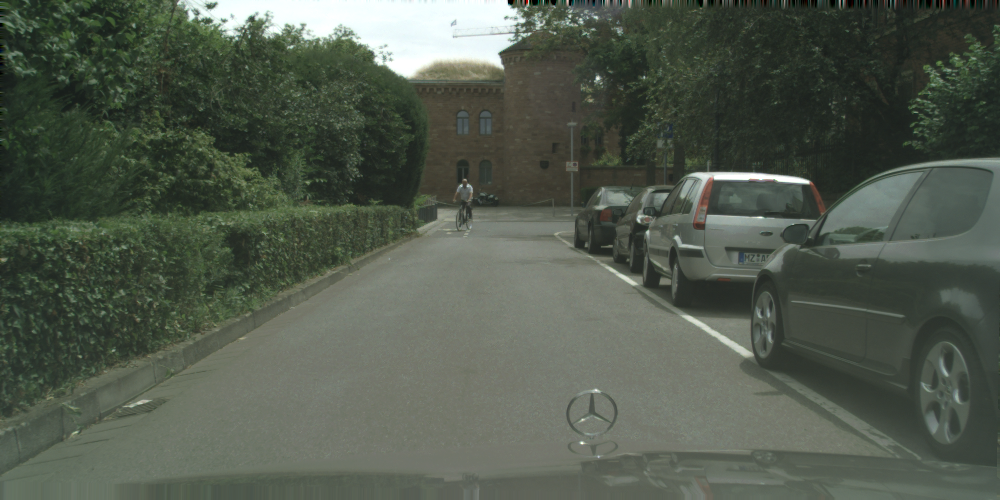
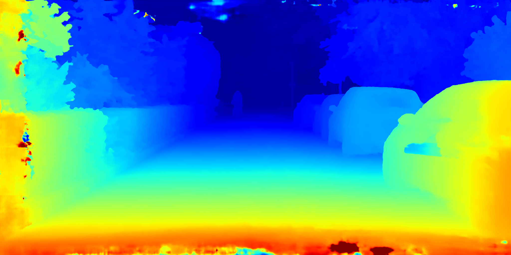
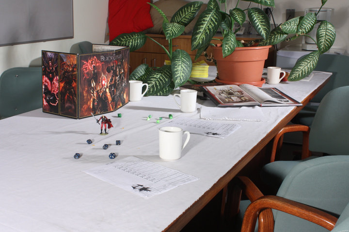
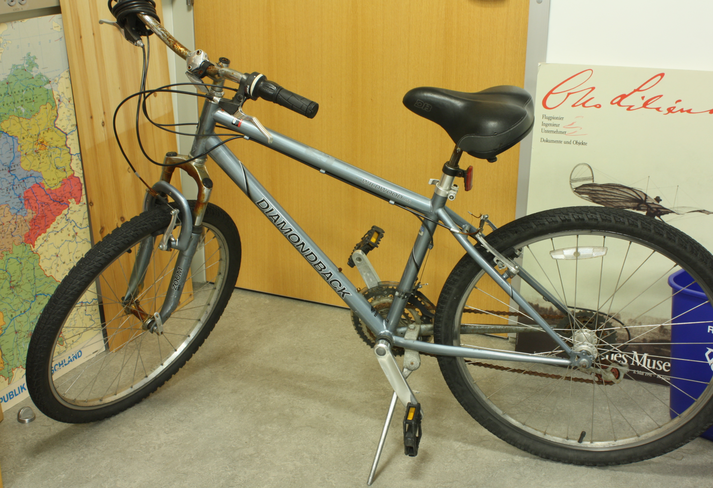
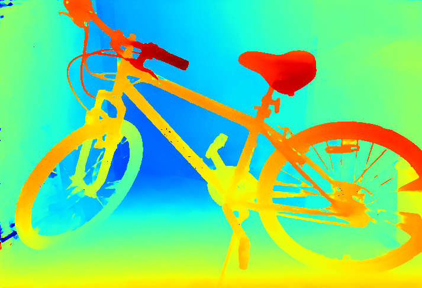

# GANet

[GA-Net: Guided Aggregation Net for End-to-end Stereo Matching](https://arxiv.org/pdf/1904.06587.pdf)

## Brief Introduction
We are formulating traditional geometric and optimization of stereo into deep neural networks ...

## Oral Presentation 

[Slides](http://www.feihuzhang.com/GANet/GANet.pptx), [Video](https://www.youtube.com/watch?v=tpyrxcGL_Zg&feature=youtu.be), [Poster](http://www.feihuzhang.com/GANet/GANet_poster.pdf)

## Building Requirements:

    gcc: >=5.3
    GPU mem: >=6.5G (for testing);  >=11G (for training, >=22G is prefered)
    pytorch: >=1.0
    cuda: >=9.2 (9.0 doesn’t support well for the new pytorch version and may have “pybind11 errors”.)
    tested platform/settings:
      1) ubuntu 16.04 + cuda 10.0 + python 3.6, 3.7
      2) centos + cuda 9.2 + python 3.7

## Install Pytorch:
You can easily install pytorch (>=1.0) by "pip install" to run the code. See this https://github.com/feihuzhang/GANet/issues/24

But, if you have trouble (lib conflicts) when compiling cuda libs,
installing pytorch from source would help solve most of the errors (lib conflicts).

Please refer to https://github.com/pytorch/pytorch about how to reinstall pytorch from source.

## How to Use?

Step 1: compile the libs by "sh compile.sh"
- Change the environmental variable ($PATH, $LD_LIBRARY_PATH etc.), if it's not set correctly in your system environment (e.g. .bashrc). Examples are included in "compile.sh".

Step 2: download and prepare the dataset

    download SceneFLow dataset: "FlyingThings3D", "Driving" and "Monkaa" (final pass and disparity files).
  
      -mv all training images (totallty 29 folders) into ${your dataset PATH}/frames_finalpass/TRAIN/
      -mv all corresponding disparity files (totallty 29 folders) into ${your dataset PATH}/disparity/TRAIN/
      -make sure the following 29 folders are included in the "${your dataset PATH}/disparity/TRAIN/" and "${your dataset PATH}/frames_finalpass/TRAIN/":
        
        15mm_focallength	35mm_focallength		A			 a_rain_of_stones_x2		B				C
        eating_camera2_x2	eating_naked_camera2_x2		eating_x2		 family_x2			flower_storm_augmented0_x2	flower_storm_augmented1_x2
        flower_storm_x2	funnyworld_augmented0_x2	funnyworld_augmented1_x2	funnyworld_camera2_augmented0_x2	funnyworld_camera2_augmented1_x2	funnyworld_camera2_x2
        funnyworld_x2	lonetree_augmented0_x2		lonetree_augmented1_x2		lonetree_difftex2_x2		  lonetree_difftex_x2		lonetree_winter_x2
        lonetree_x2		top_view_x2			treeflight_augmented0_x2	treeflight_augmented1_x2  	treeflight_x2	
	
    download and extract kitti and kitti2015 datasets.
        
Step 3: revise parameter settings and run "train.sh" and "predict.sh" for training, finetuning and prediction/testing. Note that the “crop_width” and “crop_height” must be multiple of 48, "max_disp" must be multiple of 12 (default: 192).

## Pretrained models:

- These pre-trained models use a batchsize of 8 on four P40 GPUs with a crop size of 240x624. 
- Eight 1080ti/Titan GPUs should also be able to achieve the similar accuracy.
- Eight P40/V100/Titan RTX (22G) GPUs would be even better.

| sceneflow (for fine-tuning, only 10 epoch) | kitti2012 (after fine-tuning) | kitti2015 (after fine-tuning)|
|---|---|---|
|[Google Drive](https://drive.google.com/open?id=1VkcBGkA_pXolgLhrWdpZPwfvzhQfWWJQ)|[Google Drive](https://drive.google.com/open?id=1WMfbEhzj-WLqYEI2jCH1YFUR6dYyzlVE)|[Google Drive](https://drive.google.com/open?id=19hVQXpcXwp7SrHgJ5Tlu7_iCYNi4Oj9u)|

## Results:

The results of the deep model are better than those reported in the paper.

#### Evaluations and Comparisons on SceneFlow Dataset (only 10 epoches)
|Models|3D conv layers|GA layers |Avg. EPE (pixel)|1-pixel Error rate (%)|
|---|---|---|---|---|
|GC-Net|19|-|1.8|15.6|
|PSMNet|35|-|1.09|12.1|
|GANet-15|15|5|0.84|9.9|
|GANet-deep|22|9|0.78|8.7|

#### Evaluations on KITTI 2012 benchmark
| Models | Non-Occluded	| All Area |
|---|---|---|
| [GC-Net](http://www.cvlibs.net/datasets/kitti/eval_stereo_flow_detail.php?benchmark=stereo&error=3&eval=all&result=8da072a8f49d792632b8940582d5578c7d86b747)| 1.77	| 2.30 |
| [PSMNet](http://www.cvlibs.net/datasets/kitti/eval_stereo_flow_detail.php?benchmark=stereo&error=3&eval=all&result=8da072a8f49d792632b8940582d5578c7d86b747) | 1.49	| 1.89 |
| [GANet-15](http://www.cvlibs.net/datasets/kitti/eval_stereo_flow_detail.php?benchmark=stereo&error=3&eval=all&result=b2d616a45b7b7bda1cb9d1fd834b5d7c70e9f4cc) | 1.36 | 1.80 |
| [GANet-deep](http://www.cvlibs.net/datasets/kitti/eval_stereo_flow_detail.php?benchmark=stereo&error=3&eval=all&result=95af4a21253204c14e9dc7ab8beb9d9b114cfb9d) | 1.19 | 1.60 |

#### Evaluations on KITTI 2015 benchmark

| Models | Non-Occluded	| All Area |
|---|---|---|
| [GC-Net](http://www.cvlibs.net/datasets/kitti/eval_scene_flow_detail.php?benchmark=stereo&result=70b339586af7c573b33a4dad14ea4a7689dc9305) | 2.61 | 2.87 |
| [PSMNet](http://www.cvlibs.net/datasets/kitti/eval_scene_flow_detail.php?benchmark=stereo&result=efb9db97938e12a20b9c95ce593f633dd63a2744) | 2.14 | 2.32 |
| [GANet-15](http://www.cvlibs.net/datasets/kitti/eval_scene_flow_detail.php?benchmark=stereo&result=59cfbc4149e979b63b961f9daa3aa2bae021eff3) | 1.73 | 1.93 |
| [GANet-deep](http://www.cvlibs.net/datasets/kitti/eval_scene_flow_detail.php?benchmark=stereo&result=ccb2b24d3e08ec968368f85a4eeab8b668e70b8c) | 1.63 | 1.81 |

## Great Generalization Abilities:
GANet has great generalization abilities on other datasets/scenes.

#### Cityscape
 

#### Middlebury

 
 

## Reference:

If you find the code useful, please cite our paper:

    @inproceedings{Zhang2019GANet,
      title={GA-Net: Guided Aggregation Net for End-to-end Stereo Matching},
      author={Zhang, Feihu and Prisacariu, Victor and Yang, Ruigang and Torr, Philip HS},
      booktitle={Proceedings of the IEEE Conference on Computer Vision and Pattern Recognition},
      pages={185--194},
      year={2019}
    }
